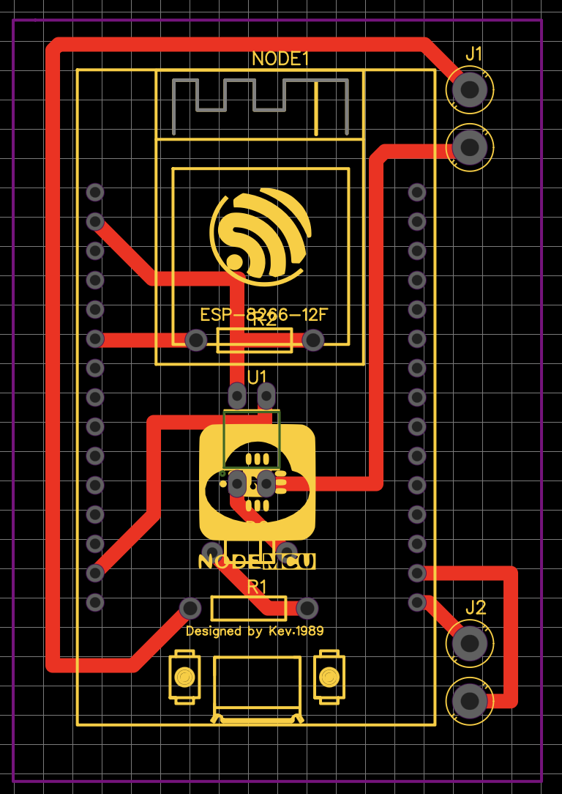
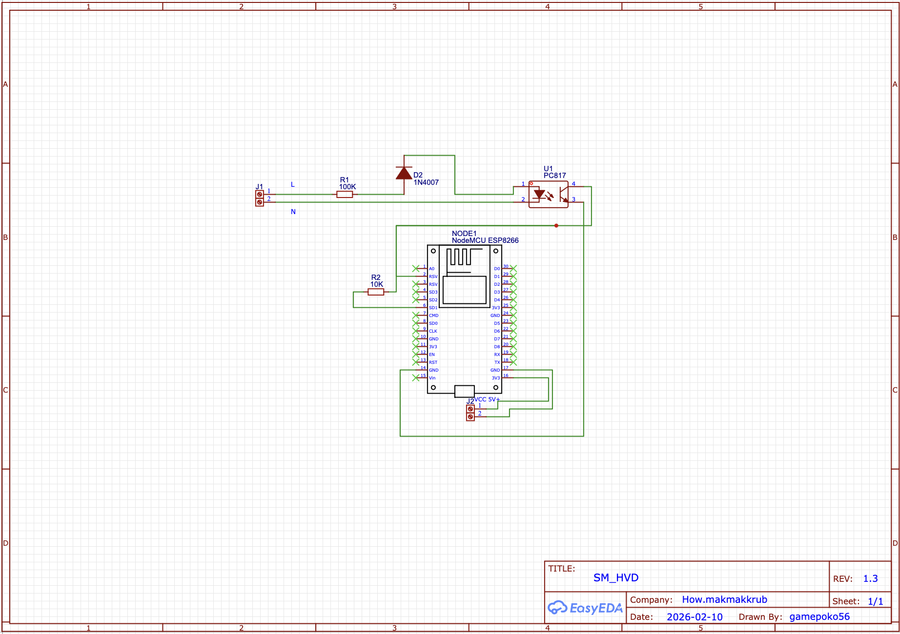
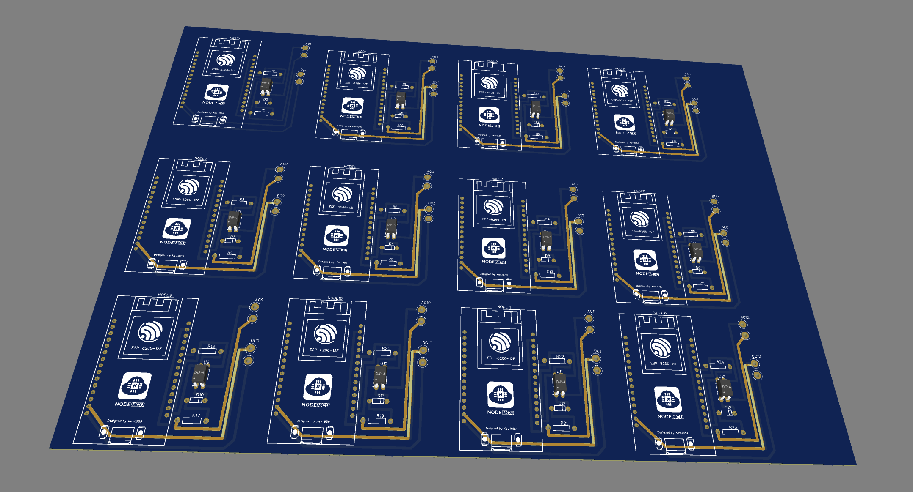

# ⚡️ SM_HVD: Smart Room & Hotel Electricity Monitoring System

> Smart IoT room power monitoring using ESP32 & ESP-NOW. Features real-time Telegram alerts for breaker power cuts and offline sensor boards, ensuring fast troubleshooting. | ระบบตรวจสอบไฟฟ้าห้องพักอัจฉริยะ แจ้งเตือนผ่าน Telegram ทันทีเมื่อมีการตัดไฟเบรกเกอร์ หรือตรวจพบบอร์ดเซนเซอร์หลุด/ขาดการติดต่อ เพื่อให้ทีมช่างเข้าแก้ไขปัญหาได้ตรงจุด

---

## ✨ Key Features (จุดเด่นของระบบ)

* 📡 **ESP-NOW Mesh Network:** เชื่อมต่อระหว่าง Master Node และ Sensor Nodes ผ่านคลื่นวิทยุ (Channel 3) โดยไม่ต้องพึ่งพา WiFi Router ประหยัดพลังงานและลดปัญหาเครือข่ายล่ม
* 💬 **Telegram Bot Integration:** แจ้งเตือนสถานะแบบ Real-time ผ่านแอปพลิเคชัน Telegram พร้อมชุดคำสั่งผู้ดูแลระบบ (Admin Commands) เช่น `/status`, `/reboot`, `/ping`
* 🔍 **Smart 3-State Detection:** ระบบวิเคราะห์สถานะอัจฉริยะ แยกแยะความผิดปกติได้ 3 ระดับ เพื่อการซ่อมบำรุงที่แม่นยำ:
  * `✅ ไฟทำงานปกติ` (ตรวจพบกระแสไฟ AC 220V)
  * `⚠️ ตัดเบรกเกอร์` (เซนเซอร์ไม่พบกระแสไฟ แต่บอร์ดยังทำงานและส่งสัญญาณแจ้งเตือนได้)
  * `❌ ระบบมีปัญหา` (Node ขาดการติดต่อเกิน 20 วินาที อาจเกิดจากปลั๊กหลุดหรืออุปกรณ์ขัดข้อง)
* ⚙️ **Smart Config (AP Fallback):** หาก Master Node เชื่อมต่อ WiFi ไม่สำเร็จ จะสลับโหมดเป็น Access Point อัตโนมัติ เพื่อให้ผู้ดูแลสามารถตั้งค่ารหัส WiFi ใหม่ผ่านหน้า Web Browser ได้ทันทีโดยไม่ต้องแก้ไขโค้ด

---

## 🛠 System Architecture (โครงสร้างสถาปัตยกรรม)

* **Master Node (ESP32):** ทำหน้าที่เป็นศูนย์กลาง รับข้อมูลจากลูกข่ายทั้งหมดผ่าน ESP-NOW และประมวลผลก่อนส่งข้อมูลผ่าน WiFi ไปยัง Telegram API
* **Sensor Nodes (ESP8266):** ติดตั้งประจำจุด/ห้องพัก ทำหน้าที่ตรวจสอบกระแสไฟฟ้า 220V ผ่านวงจร Optocoupler (AC Detection) และส่งข้อมูลสถานะกลับไปยัง Master Node ทุกๆ 2 วินาที

---

## 📸 Hardware Design & Production

โปรเจกต์นี้ผสมผสานทั้งงาน Software, Hardware และ Media Production เข้าด้วยกันอย่างลงตัว:
* **3D CAD Design:** เคสอุปกรณ์และจุดติดตั้งถูกออกแบบ 3D Modeling อย่างละเอียดด้วยโปรแกรม **SolidWorks**
* **PCB Design & Development:** ออกแบบและพัฒนาแผ่นวงจรพิมพ์ (PCB) เอง เพื่อความเสถียรและความปลอดภัยในการใช้งานจริง

  |  |  |  |
  | :---: | :---: | :---: |
  | *PCB Schematic* | *PCB 3D Visualization* | *Final Fabricated PCB* |

* **3D Printing:** ชิ้นส่วนประกอบฮาร์ดแวร์ถูกผลิตขึ้นรูปด้วยเครื่องพิมพ์ 3D **Anycubic Kobra 2 Pro** เพื่อให้ได้ขนาดที่แม่นยำ แข็งแรง ทนทานต่อการติดตั้งใช้งานจริง
* **Media & Presentation:** ภาพถ่ายฮาร์ดแวร์ วิดีโอสาธิตการทำงาน และสื่อนำเสนอทั้งหมด ดำเนินการถ่ายทำและตัดต่อโดยทีมงาน **hiw.makmakkub production by POKOMAN**

---

## 🚀 Future Development (แผนการพัฒนาในอนาคต)

* พัฒนา Web Dashboard สำหรับมอนิเตอร์สถานะรวมของทุกห้องผ่านหน้า UI ที่สวยงามและใช้งานง่าย (Frontend Development ด้วย **React** และ **TypeScript**)
* จัดเก็บประวัติการไฟตก/ไฟดับลงฐานข้อมูล Cloud Database แบบ Real-time (เช่น **Firebase**) เพื่อวิเคราะห์ความเสถียรของระบบไฟฟ้าในระยะยาว
* ขยายขอบเขตเซนเซอร์สู่ระบบ Smart Farming หรือการเชื่อมต่อกับอุปกรณ์ IoT อื่นๆ ภายในเครือข่าย

---

## 👨‍💻 About the Developer

**Supachok Hornsombat (Pluem)**
* 🎓 **Education:** Computer Technology, Faculty of Industrial Education and Technology, King Mongkut's Institute of Technology Ladkrabang (KMITL)
* 💻 **Role:** Programmer / IoT Developer / 3D Designer

**Let's Connect:**
* 📧 Email: gamepoko56@gmail.com
* 📷 IG: [@pokomankrub](https://www.instagram.com/pokomankrub/)

---

## ⚖️ License

This project and its contents (including 3D designs, images, and documentation) are licensed under the **Creative Commons Attribution-NonCommercial 4.0 International License (CC BY-NC 4.0)**. 

You are free to share and adapt the material for personal and educational purposes, provided you give appropriate credit to the original creator. **You may NOT use the material for commercial purposes (e.g., selling the hardware, using the code for commercial projects, or rebranding for profit) without explicit written permission.**

For commercial inquiries or project collaborations, please contact: gamepoko56@gmail.com

> *📝 **Note:** The source code (C++/Arduino) for this hardware system is kept in a Private Repository for internal use, research, and security reasons.*
